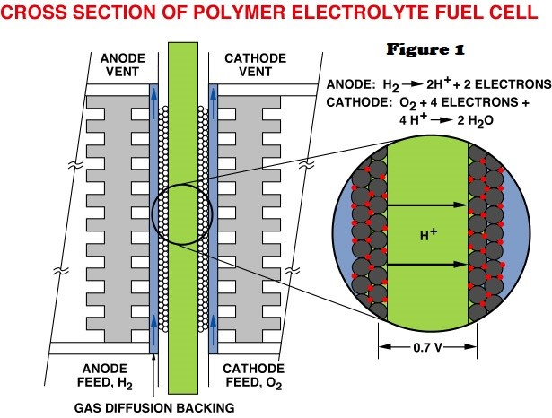
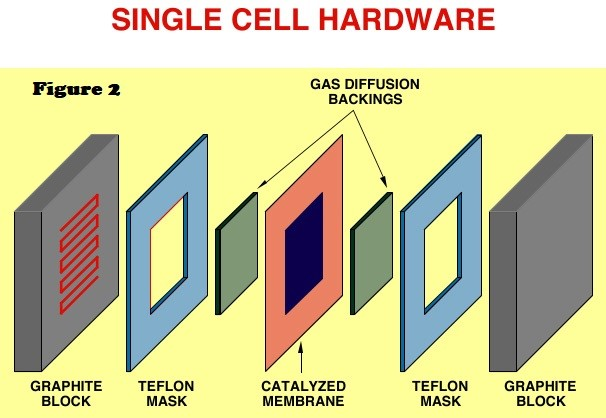

## What is PEM?		

	
Proton exchange membrane fuel cells (PEMFCs) have attracted much interest recently. The need for an efficient, non-polluting power source for vehicles in urban environments, emphasized by recent legislative initiatives, has resulted in increased attention to the option of fuel-cell powered vehicles of high efficiency and low tail pipe emissions. Hydrogen is the most suitable fuel for a fuel cell powered vehicle, providing the highest conversion efficiency for fuel-on-board-to-electric-power and generating zero tail-pipe emission since water is the only product of the hydrogen/air fuel cell process. Hydrogen fuel could be carried on board the vehicle as either neat hydrogen, in the form of pressurized gas or cryogenically stored liquid, or in the form of a more ordinary liquid fuel, such as methanol or liquid hydrocarbon, which needs to be processed/converted on board the vehicle to a mixture of hydrogen and CO2. The latter type of vehicle will not satisfy the criteria of a Zero-Emission-Vehicle (ZEV), but may still satisfy the criteria for an Ultra Low Emission Vehicle (ULEV). 

	
Of various fuel cell systems considered, the proton exchange membrane fuel cell technology seems to be most suitable for terrestrial transportation applications. This is thanks to low temperature of operation (hence, fast cold start), perfect CO2 tolerance by the electrolyte and a combination of high power density and high energy conversion efficiency. Key barriers for the development of this fuel cell technology for terrestrial applications, considered very high just 5-10 years ago, have been successfully overcome. As a result, automotive and fuel cell manufacturing industries have initiated significant technology, validation programs and demonstrations which include fuel cell powered vehicles, stationary power generation systems and battery replacement devices. Market entry of PEMFCs through the latter applications may actually precede implementation of such fuel cells in vehicular power systems, in large part because of less stringent demands on systems cost. 

	
Figure 1 is a schematic presentation of the cross-section of a single proton exchange membrane fuel cell (PEMFC). The "heart" of the cell, which is magnified in the scheme, is the so-called membrane-electrode assembly. In its simplest form, the "electrode" component of the M&E assembly would be a thin film (5-50 mm thick) containing dispersed Pt catalyst. This catalyst layer is in good contact with an ionomeric membrane, the central slab in the scheme in figure 1, which serves as the electrolyte and the gas separator in the cell. The ionomeric membrane electrolyte is typically 50-175 mm thick.

	
A so-called M&E assembly thus consists of an ionomeric membrane with thin catalyst layers bonded onto each of its two major surfaces. It can be seen that the M&E assembly has the generic structure of an electrochemical cell: electrode/electrolyte/electrode, packaged in the form of a sandwich of three thin films. The "gas-diffuser"(or "backing") layers in immediate contact with the catalyzed membrane are made of hydrophobized porous carbon paper, or carbon cloth. These layers are typically 100-300 mm thick and are wet-proofed by treatment with poly-tetrafluoroethylene (PTFE). The role of these gas diffusers is to enable direct and uniform access of the reactant gases, hydrogen and oxygen, to the catalyst layers, without having to diffuse through films of liquid water.

Fig1. Cross section of PEMFC

	
The single cell is completed by current collector plates, which usually contain machined flow fields, as required for effective distribution of reactant gases along the surfaces of the electrodes. These plates, traditionally made of high density graphite, become bipolar plates in the fuel cell stack, in which case they would have gas flow fields on both sides, as shown schematically in Figure 1. A general view of a single cell hardware is presented in Figure 2. The Teflon masks shown are gaskets that confine the gas flow to the active area and provide, together with the periphery of the ionomeric membrane, an effective seal. In a fuel cell stack, many such cells are stacked together to generate the voltage required for a given application, since a single hydrogen/oxygen fuel cell operated at only about 0.7V.

Fig2. Single cell hardware

Fig3. PEMFC graphic by Marc Marshall, Schatz Energy Research Center

