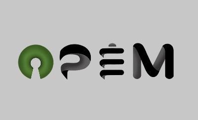

<div align="center">

<br/>
<a href="https://www.python.org/"></a>
<a href="https://travis-ci.org/ECSIM/opem"></a>
<a href="https://ci.appveyor.com/project/sepandhaghighi/opem"></a>
<a href="https://codecov.io/gh/ECSIM/opem">
  
</a>
<a href="https://badge.fury.io/py/opem"></a>
<a href="https://doi.org/10.5281/zenodo.1133110"></a>
<a class="badge-align" href="https://www.codacy.com/app/sepand-haghighi/opem?utm_source=github.com&amp;utm_medium=referral&amp;utm_content=ECSIM/opem&amp;utm_campaign=Badge_Grade"></a>

</div>
	
----------

## Overview			
The Open-Source PEMFC Simulation Tool (Opem) is an open-source mathematical simulation package for polymer electrolyte fuel cells. It contains a database of physical phenomena equations,  and kinetics mathematical models in order to perform static/dynamic analysis of PEMFC. The goal of the software is to prepare a platform for collaborative development of  PEMFC mathematical models.

## Installation		

### Source Code
- Download [Version 0.1](https://github.com/ecsim/opem/archive/v0.1.zip) or [Latest Source ](https://github.com/ecsim/opem/archive/master.zip)
- Run `pip install -r requirements.txt` or `pip3 install -r requirements.txt` (Need root access)
- Run `python3 setup.py install` or `python setup.py install` (Need root access)				

### PyPI


- Check [Python Packaging User Guide](https://packaging.python.org/installing/)     
- Run `pip install opem` or `pip3 install opem` (Need root access)

### Exe Version (Only Windows)
- Download and run [Exe-Version 0.1](https://www.dropbox.com/s/5r72n1ayqbs3oq3/OPEM%28V0.1%29.zip?dl=0)
## Usage

### CLI (Command Line Interface)
- Open `CMD` (Windows) or `Terminal` (UNIX)
- Run `python -m opem` or `python3 -m opem`
- Enter PEM cell parameters
	-  `T` :  Cell Operation Temperature [K]
	-  `PH2` : Partial Pressure [atm]
	-  `PO2` : Partial Pressure [atm]
	-  `i-start` : Cell operating current start point [A]
	-  `i-step` : Cell operating current step
	-  `i-stop` : Cell operating current end point [A]
	-  `A` : active area [cm2]
	-  `l` : Membrane Thickness [cm]
	-  `lambda` : is an adjustable parameter with a min value of 14 and max value of 23
	-  `R` : R-Electronic [ohm] (*Optional) 
	-  `B` : An empirical constant depending on the cell and its operation state (Tafel Slope) [V]
	-  `JMax` : maximum current density [A/cm2]
	-  `N` : Number Of Single Cells
- Find Your Result In `.opem` & `.csv` files	

<div align="center">

<a href="https://asciinema.org/a/154228" target="_blank"></a>

</div>
		

## Issues & Bug Reports			

Just fill an issue and describe it. We'll check it ASAP!							
or send an email to [opem@ecsim.ir](mailto:opem@ecsim.ir "opem@ecsim.ir"). 


## TODO		

- [ ] Static Analysis
  - [x] Amphlett Static Model
  	- [x] Nernst Voltage
  	- [x] PEMFC losses model
  	- [x] Power of PEMFC
  	- [x] Efficiency of PEMFC
  - [ ] Larminiee-Dicks Static Model
  - [ ] Chamberline-Kim Static Model
- [X] Flat Output
    - [x] Simulation Result
    - [X] CSV File
- [ ] GUI
  - [ ] Plot Graphs
  - [ ] Input/Output
- [ ] Dynamic Analysis
  - [ ] Impedance model of fuel cell
  - [ ] Dicks-Larminie Danymic Model
  - [ ] Becherif-Hissel Dynamic model
  - [ ] PEMFC Charge Transport
  - [ ] PEMFC Mass Trasport
  - [ ] PEMF Heat Transfer
  - [ ] PEMFC Catalyst Layers
  - [ ] PEMFC Flow Feild Plates


## Contribution			

You can fork the repository, improve or fix some part of it and then send the pull requests back if you want to see them here. I really appreciate that. ❤️			

Remember to write a few tests for your code before sending pull requests. 


## License

<a href="https://github.com/ecsim/opem/blob/master/LICENSE"></a>


## Donate to our project
								
<h3>Bitcoin :</h3>					

```12Xm1qL4MXYWiY9sRMoa3VpfTfw6su3vNq```			


<h3>Payping (For Iranian citizens) :</h3>

<a href="http://www.payping.net/sepandhaghighi" target="__blank"></a>	
